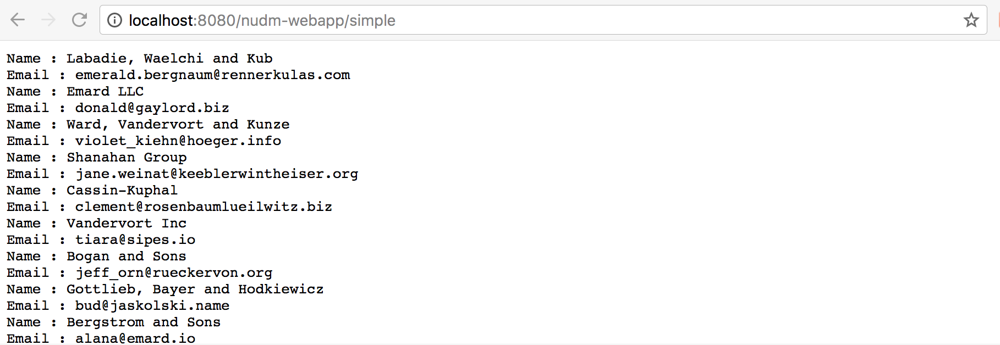

# Setting up your environment
Remember, these are just suggestions!  Please use all, some or none of the below.

# IDE - integrated development environment
[Wiki definition](https://en.wikipedia.org/wiki/Integrated_development_environment)  

Pick any IDE that you prefer.  If you need some suggestions for java development IDE's, here is a couple:
1. [Eclipse](https://www.eclipse.org/users/) - Free and has lots of plugins available
2. [IntelliJ IDEA](https://www.jetbrains.com/idea/download/#section=mac) -  Very good tool with a free trial

## Download starter project
The project includes the documentation and many other useful things that we'll use to setup your environment.

* Clone or download the project from Github.com
    1. Navigate to [https://github.com/HS2-SOLUTIONS/nudm-hack](https://github.com/HS2-SOLUTIONS/nudm-hack)
    2. You can either clone the project with git if you know how to use it or you could download the project as a zip file.
        1. To clone, run 
        ```bash
         git clone https://github.com/HS2-SOLUTIONS/nudm-hack.git
        ```
        2. To download zip file, click on the green Clone or download and select `Download ZIP` option
    3. If you've downloaded the file, unzip the contents and navigate to that location in terminal  
    4. If you've cloned the project, navigate to the numd-hack directory
    5. This will be the root project directory

## Database
We have created a sample schema with some random data in mySQL database for you to use as a starting point.  Follow the below steps to download and install mySQL and then import the data.  Make sure you've got the start project on your machine.  It contains the data file.

* Download mySQL database
    1. The download is available here: [https://dev.mysql.com/downloads/mysql/](https://dev.mysql.com/downloads/mysql/)
    
* Install mySQL database  
    1. Note the password that you create for `root` user during the install process
    2. The instructions are available here: [https://dev.mysql.com/doc/refman/5.7/en/installing.html](https://dev.mysql.com/doc/refman/5.7/en/installing.html)
    3. Make sure that mySQL is running.  Check for instructions on starting mySQL here: [https://dev.mysql.com/doc/mysql-getting-started/en/#mysql-getting-started-installing](https://dev.mysql.com/doc/mysql-getting-started/en/#mysql-getting-started-installing)
    
* Import provided schema
    1. Login to mysql in terminal
    ```bash
    mysql -u root -p
    ```
    2. Use the password you've created for `root` user during installation process
    3. Create application user
    ```bash
    CREATE USER 'app'@'localhost' IDENTIFIED BY 'app';
    GRANT ALL PRIVILEGES ON *.* TO 'app'@'localhost' IDENTIFIED BY 'app';
    ```
    4. Quit mysql prompt `\q`
    5. Login with new application user and use new password `app`
    ```bash
    mysql -u app -p
    ```
    6. Create new database called `nudm`
    ```bash
    create database nudm;
    ```
    7. Quit mysql prompt `\q`
    8. From the root of your project execute below to import the data using `app` password
    ```bash
    mysql -p -u app nudm < nudmdb.sql
    ```
    
    You now have a user `app` that you could use to connect to your database and the basic data set for the hack!
    
## Getting starter project to run in tomcat
1. Maven or Gradle could be used to build and deploy the project
2. These instructions will use Maven, but gradle is setup in the project and could be used as well if that is something you feel more comfortable with
3. Downloading and Installing Maven
    1. Download from here: [https://maven.apache.org/download.cgi](https://maven.apache.org/download.cgi)
    2. Installation instructions [https://maven.apache.org/install.html](https://maven.apache.org/install.html)
    3. Test installation by running `mvn -h`
4. From project root directory run `mvn tomcat7:run`
    1. Expected output is below:
        ```bash
        [INFO] Scanning for projects...
        [WARNING] 
        [WARNING] Some problems were encountered while building the effective model for com.nudm.webapp:nudm-webapp:war:1.0-SNAPSHOT
        [WARNING] 'build.plugins.plugin.version' for org.apache.tomcat.maven:tomcat7-maven-plugin is missing. @ line 26, column 15
        [WARNING] 
        [WARNING] It is highly recommended to fix these problems because they threaten the stability of your build.
        [WARNING] 
        [WARNING] For this reason, future Maven versions might no longer support building such malformed projects.
        [WARNING] 
        [INFO]                                                                         
        [INFO] ------------------------------------------------------------------------
        [INFO] Building nudm-webapp Maven Webapp 1.0-SNAPSHOT
        [INFO] ------------------------------------------------------------------------
        [INFO] 
        [INFO] >>> tomcat7-maven-plugin:2.2:run (default-cli) @ nudm-webapp >>>
        [INFO] 
        [INFO] --- maven-resources-plugin:2.5:resources (default-resources) @ nudm-webapp ---
        [debug] execute contextualize
        [WARNING] Using platform encoding (UTF-8 actually) to copy filtered resources, i.e. build is platform dependent!
        [INFO] Copying 0 resource
        [INFO] 
        [INFO] --- maven-compiler-plugin:2.3.2:compile (default-compile) @ nudm-webapp ---
        [INFO] Nothing to compile - all classes are up to date
        [INFO] 
        [INFO] <<< tomcat7-maven-plugin:2.2:run (default-cli) @ nudm-webapp <<<
        [INFO] 
        [INFO] --- tomcat7-maven-plugin:2.2:run (default-cli) @ nudm-webapp ---
        [INFO] Running war on http://localhost:8080/nudm-webapp
        [INFO] Using existing Tomcat server configuration at /Users/dmitryrozental/git/nudm-webapp/target/tomcat
        [INFO] create webapp with contextPath: /nudm-webapp
        Feb 23, 2018 3:21:15 PM org.apache.coyote.AbstractProtocol init
        INFO: Initializing ProtocolHandler ["http-bio-8080"]
        Feb 23, 2018 3:21:15 PM org.apache.catalina.core.StandardService startInternal
        INFO: Starting service Tomcat
        Feb 23, 2018 3:21:15 PM org.apache.catalina.core.StandardEngine startInternal
        INFO: Starting Servlet Engine: Apache Tomcat/7.0.47
        Feb 23, 2018 3:21:17 PM org.apache.coyote.AbstractProtocol start
        INFO: Starting ProtocolHandler ["http-bio-8080"]
        ```
    1. This command will use tomcat plugin to build your app and run in tomcat server on the default port: 8080
    2. To view your app, navigate to either one of the below.  We will explain in the next seciton what those pages are.
        1. [http://localhost:8080/nudm-webapp/simple](http://localhost:8080/nudm-webapp/simple)
        2. [http://localhost:8080/nudm-webapp/](http://localhost:8080/nudm-webapp/)
        3. [http://localhost:8080/nudm-webapp/hello.jsp](http://localhost:8080/nudm-webapp/hello.jsp)
    3. For the `/simple` path you should see:
    
    
## Understanding the starter app
1. This is a simple java web app
2. The app comes with a tomcat plugin bundled with maven
3. That means you can simply run `mvn tomcat7:run` to package and deploy the app to the Tomcat server
2. It has a sample servlet and a sample jsp to get you going
    1. In the `./src/main/webapp` directory you'll see two jsp pages.  You could add your jsp's here.  The index.jsp will be displayed at the root url and if you would like to navigate to hello.jsp, you'd want to go to [http://localhost:8080/nudm-webapp/hello.jsp](http://localhost:8080/nudm-webapp/hello.jsp)
    2. The servlet is located here: `./src/main/java/com/nudm/web/SimpleServlet.java`.    
    You can navigate to the sample servlet at this location: [http://localhost:8080/nudm-webapp/simple](http://localhost:8080/nudm-webapp/simple) The http servlet version 3.0 can now be configured with annotations.
3. Simple servlet shows you how to connect to your database, select some data and print it to the user.  The file has comments to help out with understanding
4. You can do the same exact thing in your jsp page, checkout the hello.jsp page for details

## Useful resources
1. [Webapps](https://www.journaldev.com/1854/java-web-application-tutorial-for-beginners)
2. [Maven in 5 minutes](https://maven.apache.org/guides/getting-started/maven-in-five-minutes.html)
2. JDBC and Servlets
    1. [Selecting data](https://www.mkyong.com/jdbc/jdbc-statement-example-select-list-of-the-records/)
    2. [Updating data](https://www.mkyong.com/jdbc/jdbc-statement-example-update-a-record/?utm_source=mkyong&utm_medium=author&utm_campaign=related-post&utm_content=3)
    3. [Inserting data](https://www.mkyong.com/jdbc/jdbc-statement-example-insert-a-record/?utm_source=mkyong&utm_medium=author&utm_campaign=related-post&utm_content=2)
    4. [Deleting data](https://www.mkyong.com/jdbc/jdbc-statement-example-delete-a-record/?utm_source=mkyong&utm_medium=author&utm_campaign=related-post&utm_content=2)
4. [JSP Syntax](https://www.tutorialspoint.com/jsp/jsp_syntax.htm)
5. [JDBC and JSP's](https://docs.oracle.com/cd/A97336_01/buslog.102/a83726/basics7.htm)